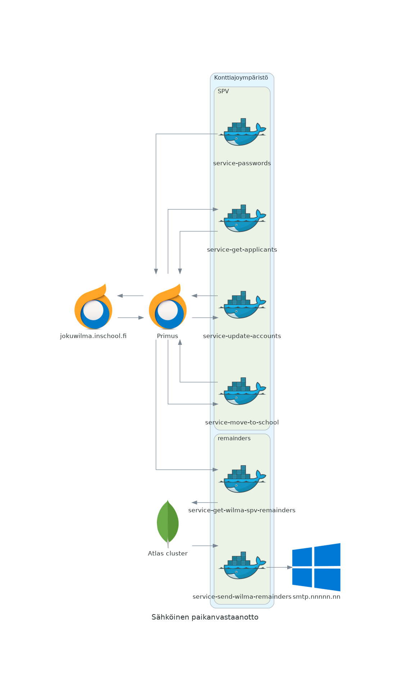

# service-password

Primus opiskelijarekisterin yhteydessä hyödynnettävä mikropalvelu, joka päivittää opiskelijan tunnusta opiskelupaikan vastaanoton jälkeen. Muuttaaa opiskelijalajia niin, että paikan vastaanottanut opiskelija voi käyttää opiskelijaroolille näkyviä lomakkeita.

Palvelu on alunperin tarkoitettu ajettavaksi kontissa esim. Kubernetes klusterissa ajastettuna. Mikropalvelu on osa laajempaa sähköisen paikanvastaanoton kokonaisuutta.

Dockerfile, jonka sisälle voi upottaa primusqueryn ja käännetyn binäärin.

https://raw.githubusercontent.com/pasiol/dockerfile-buster-slim-pq/main/Dockerfile

## Käyttö binäärinä

Kääntäminen

    make compile

    HOST=palvelimen_osoite PORT=NNNN ./bin/service-update-accounts
---
    HOST=palvelimen_osoite PORT=NNNN ./bin/service-update-accounts

## Primus-tuontimääritykset

main.go

    updateAccountConfig = ""

## Suodattimet hakija- ja opiskelijarekisteriin

config/query.go

    pq.Search = ""

## Salaisuudet

config/secrets.go